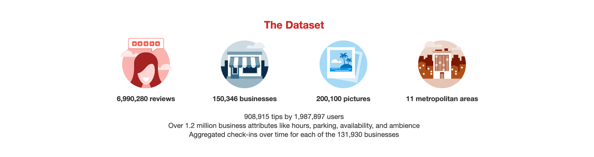

<div align="center">
<br/>

[](https://github.com/eliwangj/review-recommendation-system/blob/main/LICENSE)

</img>

</div>


# Online Review Recommendation System
It is estimated that we make 35,000 decisions every single day. Among those decisions, a larger
and larger amount are being influenced by recommendation systems - from what you order on DoorDash for lunch to what movies you watch on Netflix.

## Overview
The goal of this project is to explore how can we leverage recommendation system to predict what restaurants a user might enjoy. We do so by predicting the rating that a user would give to a restaurant, given both parties' characteristics.

<div align="center">

</div>

### Dataset
The dataset was generated using the [Yelp Open Dataset](https://www.yelp.com/dataset) with some filters. I randomly took 60% of the data as the training set, 20% as the validation set, and 20% as the testing set.

Number of user profiles: **1.5M**

Number of businesses: **188K**

Number of rows in the training set: **455K**

Number of rows in the validation set: **142K**

Number of rows in the test set: **142K**

<div align="center">

</div>


### Tech Stack
**Python**: pandas, numpy

**Spark**: PySpark

**XGBoost**: XGBRegressor


## Getting Started
Feel free to run this program on your computer if you want to try it out. Be sure to have Spark installed.
```bash
<your-python-path> review-rs.py <folder_path> <test_file_name> <output_file_name>
```
`folder_path`: the path of dataset folder, including at least `yelp_train.csv`, `user.json`, `business.json`, `tip.json`, and `checkin.json`.

`test_file_name`: the name of the testing dataset, including the file path

`output_file_name`: the name of the prediction result file, including the file path


## Performance
I use **RMSE** (Root Mean Squared Error) as a metric for the performance of this recommendation system. My best attempt was 0.9793, which beats TAs' score of 0.9800.